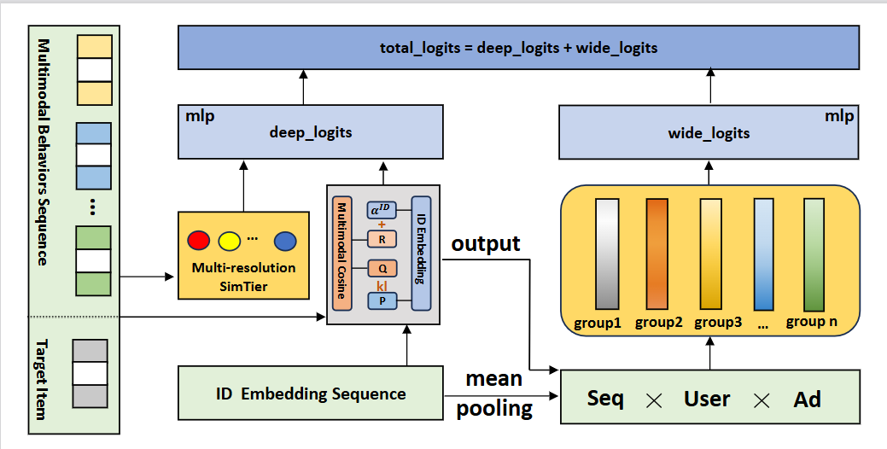

<h1 align="center">DBN-MUIM：深度宽度多模态用户兴趣建模网络</h1>

<p align="center">
    <em>Deep-Broad Multimodal User Interest Modeling</em>
</p>

<p align="center">
    <a href="https://github.com/bai-then-hei/DBN-MUIM"></a>
    <a href="https://taobao-mm.github.io/"></a>
    <a href="LICENSE"></a>
    <a href="https://arxiv.org/abs/2512.07216"></a>
</p>

## 目录

- [1. 概述](#1-概述)
- [2. 方法 / 架构](#2-方法--架构)
  - [深度侧：多粒度直方图](#深度侧多粒度直方图)
  - [深度侧：KL 散度多模态与 ID 对齐](#深度侧kl-散度多模态与-id-对齐)
  - [宽度侧：显式序列-非序列特征交互](#宽度侧显式序列-非序列特征交互)
- [3. 关键特性](#3-关键特性)
- [4. 仓库结构](#4-仓库结构)
- [5. 数据集](#5-数据集)
- [6. 环境安装](#6-环境安装)
- [7. 快速开始（训练 / 评估）](#7-快速开始训练--评估)
- [8. 配置说明](#8-配置说明)
- [9. 消融实验](#9-消融实验)
- [10. 引用与许可](#10-引用与许可)

---

## 1. 概述

在本节中，我们从多模态行为序列中建模用户兴趣。此前的研究通过设计精心的注意力机制和提升计算效率，探索了端到端的序列建模。尽管这些方法在显式或隐式建模方面都表现出较强的性能，但它们仍然主要依赖于以 ID 为中心的表示，这本质上存在语义冷启动问题和有限的跨域泛化能力。

我们提出了 **DBN-MUIM（Deep-Broad Multimodal User Interest Modeling，深度宽度多模态用户兴趣建模网络）**，一个解决多模态序列推荐中两个核心挑战的框架：

1. **多模态序列与 ID 协同信号的对齐**
2. **可扩展的特征交互建模**

整体架构采用**深度-宽度双分支设计**，包括*深度网络分支*和*宽度网络分支*：

```

```

---

## 2. 方法 / 架构

### 深度侧：多粒度直方图

多模态信号提供了超越 ID 协同信号的丰富语义信息，但由于多模态空间与协同空间之间的固有错位，将其与序列推荐集成仍然具有挑战性。一条研究线专注于通过语义 ID 学习或量化进行语义标记化与对齐，但对如何将语义信号显式地纳入序列兴趣建模关注有限。另一条工作线利用目标感知的多模态相似度来增强序列建模。SimTier 将目标行为之间的多模态相似度转换为直方图风格的表示。最新的终身兴趣建模方法 MUSE 进一步引入了语义感知目标注意力（SA-TA），通过结合多通道相似度信号和行为注意力分数来增强目标感知兴趣提取。然而，现有方法通常依赖于粗粒度的序列级聚合和后期融合，限制了语义特征与协同特征之间的细粒度交互。

针对这些局限性，我们在深度侧设计了**多粒度直方图（MGH）**模块（`model/base_model/simtier.py` 中的 `cosine_simtier_list`）。与以往使用单一相似度直方图的方法不同，MGH 在多个分辨率级别上捕捉目标物品与用户行为序列之间的多模态相似度。这种多分辨率设计使模型能够同时捕获粗粒度的语义模式和细粒度的相似度差异，为下游用户兴趣建模提供更丰富的多模态信号。

```
                    ┌──────────────────────────────────────────┐
                    │         多粒度直方图结构图（MGH）          │
                    │   target ─┬─ ε=0.1 → 22 bins              │
                    │            ├─ ε=0.2 → 12 bins              │
                    │            ├─ ε=0.3 →  8 bins              │
                    │            ├─ ε=0.5 →  6 bins              │
                    │            └─ ε=0.6 →  4 bins              │
                    └──────────────────────────────────────────┘
```

### 深度侧：KL 散度多模态与 ID 对齐

为了弥合多模态语义表示与 ID 协同信号之间的差距，我们在深度分支中引入了基于 **KL 散度**的对齐机制。核心思想是将基于 ID 的注意力分布视为**学生模型**，学习向多模态相似度分布（**教师模型**）对齐。具体来说，对于每个用户行为序列，ID 注意力头生成一个关于历史物品的注意力分布，而多模态相似度分布通过多粒度直方图模块计算。然后我们最小化这两个分布之间的 KL 散度，促使 ID 注意力在训练过程中融入多模态语义信息。

这一设计的创新性在于将 KL 散度应用于 ID 与多模态特征空间的对齐。与传统的将多模态特征作为侧信息拼接或进行后期融合的方法不同，基于 KL 的对齐损失使得多模态信息能够深度、细粒度地集成到 ID 注意力机制中。这使得模型既能继承多模态表示的语义泛化能力，又能保留基于 ID 的协同过滤优势。

```
              ┌──────────────────────────────────────────────┐
              │   KL 对齐：多模态 与 ID 嵌入                   │
              │   ID 注意力分布(学生) ──KL──▶ 多模态相似度(教师) │
              └──────────────────────────────────────────────┘
```

> **关键创新点**：KL 散度损失提供了一种将多模态语义知识蒸馏到 ID 注意力分布中的原则性方法，使得 ID 序列在训练过程中深度融合多模态信息。

### 宽度侧：显式序列-非序列特征交互

在宽度侧，我们设计了**广度融合模块（Broad Fusion, BLS）**，用于建模序列特征与非序列特征之间的显式交叉交互。序列特征来源于用户行为序列，携带动态的用户兴趣信号。非序列特征包括静态用户画像、物品属性和上下文信息。这两类特征之间的交互对于提升预测泛化能力至关重要。

具体来说，广度融合模块接收两组特征作为输入：（1）来自深度分支的序列级聚合表示，（2）包含用户和广告嵌入的非序列特征。然后应用**广度学习（Broad Learning）架构**——由特征映射层和增强节点堆叠而成（`model/base_model/bls.py` 中的 `HyBroadFusion`）——高效地建模这两组特征之间的交叉交互。与穷举所有两两特征交互的方法（如因子分解机或深度交叉网络）不同，我们的广度融合模块以显著更低的计算成本实现了高阶交互建模。

```
                ┌──────────────────────────────────────────┐
                │             宽度堆叠图（BLS）              │
                │   特征映射层 ──▶ 增强节点 ──▶ 交叉输出       │
                └──────────────────────────────────────────┘
```

这一显式的序列-非序列交互分支作为深度分支的互补宽度组件，捕捉了 CTR 预测所必需但深度 MLP 难以有效学习的特征交叉信号。
---

## 3. 关键特性

- **多粒度直方图（MGH）**：在多个分辨率（`simtier_eps_list`，如 `[0.1, 0.2, 0.3, 0.5, 0.6]`）上捕捉目标物品与行为序列之间的多模态相似度，支持 `multi` / `single` / `none` 三种模式，便于粒度消融。
- **KL 散度多模态-ID 对齐**：将 ID 注意力分布向多模态相似度分布蒸馏（默认权重 `kl_loss_weight=0.05`），可配合温度参数 `kl_temperature` 调节。
- **语义感知目标注意力（SA-TA，`use_sata`）**：结合多通道相似度信号与行为注意力分数，增强目标感知兴趣提取。
- **可插拔宽度分支**：通过 `width_method` 切换不同的特征交叉模块（`bls`、`triple_bls`、`deepfm`、`dcnv2`、`cin`、`gdcn`、`fcn`、`sfg`、`final` 等），并支持门控融合（`bls_gate`）与可选的 BLS 权重（`bls_l2_weight`）正则。
- **可扩展 / 可复现**：基于 Taobao-MM 大规模多模态序列数据集，支持多卡 DDP 分布式训练、Checkpoint 保存/恢复、注意力导出（`export_attn`）与损失平面锐度分析（`compute_sharpness`）。
- **完备的消融脚本**：覆盖深度侧与宽度侧各类消融的 `config/abl_*.json` 与 `config/width_abl_*.json`，及配套的 `analysis/` 可视化分析脚本。

---

## 4. 仓库结构

```
DBN-MUIM
├── main.py                     # 训练 / 评估入口（支持 CLI 覆盖配置、DDP）
├── trainer.py                  # Trainer：训练、评估、注意力导出、锐度分析
├── requirements.txt            # 基础 Python 依赖
├── data_preprocess.ipynb       # 数据处理示例
├── LICENSE                     # Apache-2.0
├── config/                     # 模型与消融实验配置文件（JSON）
│   ├── muse.json               # 主模型（DBN-MUIM / MUSE）完整配置
│   ├── din.json                # DIN 基线配置
│   ├── abl_*.json              # 深度侧消融配置
│   ├── width_abl_*.json        # 宽度侧消融配置
│   └── muse_{afm,afn,cin,dcnv2,deepfm,fcn,fmfm,gdcn,sfg,fibinet,final,finalmlp}.json
├── model/
│   ├── muse.py                 # MUSE_DIN：深度 + 宽度双分支主模型
│   └── base_model/
│       ├── bls.py              # 广度融合（HyBroadFusion / HyTripleFusion 等）
│       ├── simtier.py          # SimTier 多粒度直方图（cosine_simtier_list）
│       ├── waid.py             # 可选宽度方法块（DeepFM/DCNv2/CIN/FCN 等）
│       ├── layers.py           # multi_head_att / fc_repeats 等共用层
│       ├── feature_embedding.py# 特征嵌入
│       └── dice.py             # DICE 激活
├── utils/
│   ├── muse_dataset.py         # 数据加载器（Dataloader）
│   ├── preprocess.py           # 数据预处理
│   └── utils.py                # AUC / GAUC 等评估指标与工具
├── script/
│   ├── run_exp.sh              # 多卡训练启动脚本
│   └── run_eval.sh             # 多卡评估启动脚本
├── analysis/                   # 消融与分析可视化脚本
│   ├── bls_cross_analysis.py   # BLS 层数 × 路数热力图
│   ├── kl_alignment_analysis.py# KL 对齐分析
│   └── plot_perf_dual_axis.py  # 单/多粒度 AUC-GAUC 双轴图
├── data/readme_data.md         # Taobao-MM 数据集说明
└── assets/overview.jpg         # 框架图
```

---

## 5. 数据集

本项目使用 **[Taobao-MM](https://taobao-mm.github.io/)** 大规模长序列多模态推荐数据集（Apache-2.0，详情见 `data/readme_data.md`）：

| 标签 | 值 |
|---|---|
| 用户数 | 8.79M |
| 物项数 | 35.4M |
| 样本数 | 99.0M（训练 76M / 测试 23M） |
| 行为序列长度 | 最长 1,000 |
| 多模态嵌入 | 每物项 128 维 SCL 多模态嵌入（int8） |
| 论文 | <https://arxiv.org/abs/2512.07216> |

安装 `huggingface_hub` 后可通过如下命令下载（约 139 GB，包含 `feature_map/`、`train/`、`test/` 与可选的 `raw/`）：

```bash
pip install huggingface_hub
huggingface-cli download --repo-type=dataset TaoBao-MM/Taobao-MM --local-dir <your/local/path>
```

> **注意**：本仓库 `config/*.json` 中的 `train_data_path` / `test_data_path` / `feature_map_path` 为占位路径，请按你的本地数据目录修改。
---

## 6. 环境安装

建议使用 `conda` 创建 Python 3.10 环境并安装依赖（`requirements.txt` 挂靠在本仓库目录下运行）：

```bash
conda create -n train python=3.10.19 -y
conda activate train

# 安装深度学习框架（本项目基于 torch 2.6）
pip install torch==2.6.0 torchvision==0.21.0 torchaudio==2.6.0

# 安装其余依赖（请将路径替换为你的本仓库 requirements.txt 绝对路径）
pip install -r <本仓库路径>/requirements.txt
```

`requirements.txt` 包含 `numpy==2.1.1`、`pandas==2.3.3`、`pyarrow==22.0.0`、`duckdb==1.4.1`。

---

## 7. 快速开始（训练 / 评估）

本项目通过 `main.py` 入口读取一个或多个 JSON 配置（后者覆盖前者），支持 `torchrun` 分布式训练。

### 7.1 修改配置

编辑 `config/muse.json`，将数据路径改为你的本地路径：

```jsonc
{
  "train_data_path":  "/data/home/<user>/data/Taobao-MM/train",
  "test_data_path":   "/data/home/<user>/data/Taobao-MM/test",
  "feature_map_path": "/data/home/<user>/data/Taobao-MM/feature_map",
  "ckpt_path":        "/data/home/<user>/ckpt"
}
```

### 7.2 多卡分布式训练（DDP）

```bash
torchrun --nproc_per_node=2 main.py \
    --config config/muse.json \
    --use_ddp \
    --exp_name muse \
    --log_dir <本仓库路径>/log
```

> 说明：
> - `--config` 可传多个配置文件，后面文件覆盖前面文件；
> - `--use_ddp` 必须保留（训练与评估均以 DDP 方式运行，后端为 `gloo`）；单卡时设置 `--nproc_per_node=1` 即可；
> - `--log_dir` 会生成 `<exp_name>.log` 日志文件。

### 7.3 仅评估

将配置中的 `job_type` 改为 `"eval"`（或新写一个测试配置文件，如 `config/muse_eval.json`），并指定已训练的 checkpoint 路径，随后运行同上的 `torchrun` 命令：

```jsonc
{
  "job_type": "eval",
  "dense_ckpt_path":  "<dense_model.pt>",
  "sparse_ckpt_path": "<sparse_model.pt>",
  "save_ckpt": false
}
```

### 7.4 批量启动脚本

仓库已提供多卡（最多 8 卡）训练 / 评估启动脚本：

```bash
bash script/run_exp.sh    # 训练
bash script/run_eval.sh   # 评估
```
---

## 8. 配置说明

以下为 `config/muse.json` 及消融配置中使用的主要字段：

| 字段 | 说明 | 示例 |
|---|---|---|
| `method` | 方法名，`muse` / `din` / `sim-soft` / `sim-hard` | `muse` |
| `job_type` | `train` 或 `eval` | `train` |
| `embedding_dim` | 嵌入维度 `D` | `12` |
| `keep_top` | 序列截断长度（保留最近 top-k 行为） | `50` |
| `batch_size` / `epochs` | 批大小 / 轮数 | `1000` / `1` |
| `dense_lr` / `sparse_lr` | 稠密 / 稀疏参数学习率 | `2e-4` / `2e-3` |
| `use_ddp` | 是否启用分布式训练 | `true` |
| `width_method` | 宽度分支方法（`none` / `bls` / `triple_bls` / `deepfm` / `dcnv2` / …） | `bls` |
| `bls_num_layers` | BLS 增强节点层数 | `3` |
| `simtier_mode` | 多粒度直方图模式：`multi` / `single` / `none` | `multi` |
| `simtier_eps_list` | 多粒度分辨率列表（控制直方图分桶数） | `[0.1, 0.2, 0.3, 0.5, 0.6]` |
| `use_sata` | 是否使用语义感知目标注意力（SA-TA） | `true` |
| `use_kl_loss` | 是否使用 KL 散度对齐损失 | `true` |
| `kl_loss_weight` | KL 损失权重 | `0.05` |
| `use_target_attn` | 是否使用目标感知注意力 | `true` |
| `use_aux_loss` | 是否使用辅助（多任务）损失 | `false` |
| `export_attn` / `attn_export_dir` | 是否导出注意力分布及输出目录 | `true` / `./attn_export` |
| `compute_sharpness` | 是否计算损失平面锐度 | `true` |
| `save_ckpt` / `resume_from_ckpt` | 是否保存 / 恢复 checkpoint | `false` |

常用评估指标由 `trainer.py` / `utils/utils.py` 计算：**AUC、GAUC**（以及 AUROC、混淆矩阵等），并输出于日志。

---

## 9. 消融实验

仓库在 `config/` 下提供了整套消融配置：

| 配置文件 | 消融内容 |
|---|---|
| `muse.json` / `abl_full.json` | 完整方法（深度 + 宽度，全部模块开启） |
| `abl_no_kl_sata.json` | 移除 KL 对齐 与 SA-TA |
| `abl_kl_only.json` | 仅保留 KL 对齐（关闭 SA-TA） |
| `abl_no_multigran.json` | 移除多粒度直方图（`simtier_mode=none`） |
| `abl_res1.json` ~ `abl_res6.json` | 多粒度分辨率敏感性（不同 `simtier_eps_list`） |
| `abl_no_bls.json` | 移除宽度分支（`width_method=none`） |
| `width_abl_bls.json` / `width_abl_triple_bls.json` / `width_abl_complex_cross.json` | 宽度分支结构消融（BLS / 三路 / 复杂交叉） |
| `muse_{afm,afn,cin,dcnv2,deepfm,fcn,fmfm,gdcn,sfg,fibinet,final,finalmlp}.json` | 宽度分支替换为不同特征交叉方法 |

配套分析脚本位于 `analysis/`（BLS 热力图、KL 对齐分析、单/多粒度 AUC-GAUC 双轴图）。

---

## 10. 引用与许可

**许可**：本仓库代码依据 [Apache License 2.0](LICENSE) 发布；数据集 Taobao-MM 亦为 Apache-2.0。
```

更多数据集细节见 `data/readme_data.md` 与 <https://taobao-mm.github.io/>。